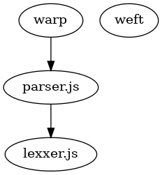
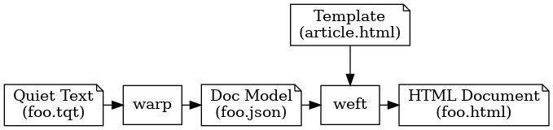

<h1>Quiet Text Tool Design Notes</h1>

<strong>From</strong> <a href="./20_Design.tqt">20_Design.tqt</a>

  Abstract:
  This document describes the design of the package's software components.
  We describe the lexxer and parser libraries and the warp and weft tools.

  <em>Portions of this document are Copyright (c) 2011, Meadhbh Hamrick. Used with permission of the author.</em>

<h2>Introduction</h2>

  All software components here are written in JavaScript.
  The <code>lexxer.js</code> and <code>parser.js</code> libraries are implemented as CommonJS modules.
  <code>Warp</code> and <code>weft</code> are implemented as executable JavaScript scripts.
  We expect users to include this package as a dependency in a package.json file and include the <code>parser.js</code> library or run the executable scripts with the <code>npx</code> command.

  The components are related to each other like this:

  <figure>
    
    <figcaption>Relationship Between Components</figcaption>
  </figure>

<ul>

  <li><code>Warp</code> is dependent on <code>parser.js</code></li>
  <li><code>Parser.js</code> is dependent on <code>lexxer.js</code></li>
  <li><code>Weft</code> is not dependent on either <code>parser.js</code> or <code>lexxer.js</code></li>

</ul>

  But the expected data-flow is this:

  <figure>
    
    <figcaption>Expected Data Flow</figcaption>
  </figure>

<ol>

  <li><code>Warp</code> converts a Quiet Text compliant text file into a Quiet Document Model (most likely represented as a JSON object.)</li>
  <li><code>Weft</code> uses the Quiet Document Model output from <code>Warp</code> and a <em>Handlebars</em> compatible template to convert the model into a HTML file (or HTML fragment).</li>

</ol>

<h2>lexxer.js</h2>

  <code>Lexxer.js</code> is a package which scans input quiet text, looking for <em>lexically significant character sequences</em>.
  This usually means things like newlines at the ends of lines and blanks at the beginnings of lines.
  To simplify the parser, the lexxer also groups lines of non-markup text as <em>text</em> symbols.

  For example, it would convert this text:

<pre>Sample Document

   In the history of all sample documents, this must
be the sampelest of them all.  Behold the exemplary
exampleness of it's text.  Marvel at the descriptive
mundanity of it's punctuation.

   Gasp at the author's bold use of two spaces after a
period. And witness, my dear friends, the complete
absence of the Oxford Comma.</pre>

  Into a sequence of <em>events</em> like this:

<ol>

  <li>Text "Sample Document"</li>

  <li>StartOfLine</li>

  <li>StartOfLine</li>

  <li>Indent 3</li>

  <li>Text "In the history of all sample documents, this must"</li>

  <li>StartOfLine</li>

  <li>Text "be the sampelest of them all.  Behold the exemplary"</li>

  <li>StartOfLine</li>

  <li>Text "exampleness of it's text.  Marvel at the descriptive"</li>

  <li>StartOfLine</li>

  <li>Text "mundanity of it's punctuation."</li>

  <li>StartOfLine</li>

  <li>StartOfLine</li>

  <li>Indent 3</li>

  <li>Text "Gasp at the author's bold use of two spaces after a"</li>

  <li>StartOfLine</li>

  <li>Text "period. And witness, my dear friends, the complete"</li>

  <li>StartOfLine</li>

  <li>Text "absence of the Oxford Comma."</li>

  <li>StartOfLine</li>

</ol>

  A few things to take away from this:

<ol>

  <li>Documents <strong>don't</strong> start with StartOfLine event.</li>

  <li>Documents end with a StartOfLine event to represent the notional blank line at the end of a document (even if the file doesn't end with a newline character.)</li>

  <li>Empty Text lines don't cause a Text event to be emitted.</li>

</ol>

<h2>parser.js</h2>

  <code>Parser.js</code> receives the events emitted from <code>lexxer.js</code> and converts them into a <em>Content Model</em>.
  It's useful to understand Quiet Text input to the lexxer uses the <em>Quiet Text Document Model</em> while output from the parser implements the <em>Quiet Text Content Model</em>.
  The two are related but not the same.
  The document model represents the format of the input Quiet Text model while the parser's content model is an abstract description of the content of the document model.

  For example, here is the content model of the previous example rendered as a JSON object:

<pre>{
  "type": "document",
  "meta": {
    "title": "Sample Document"
  },
  "content": [
    {
      "type": "paragraph",
      "meta": {
        "name": "/1"
      },
      "content": [
        {
          "type": "sentence",
          "content": "In the history of all sample documents, this must be the sampelest of them all."
        },
        {
          "type": "sentence",
          "content": "Behold the exemplary exampleness of it's text."
        },
        {
          "type": "sentence",
          "content": "Marvel at the descriptive mundanity of it's punctuation."
        }
      ]
    },
    {
      "type": "paragraph",
      "meta": {
        "name": "/2"
      },
      "content": [
        {
          "type": "sentence",
          "content": "Gasp at the author's bold use of two spaces after a period."
        },
        {
          "type": "sentence",
          "content": "And witness, my dear friends, the complete absence of the Oxford Comma."
        }
      ]
    }
  ]
}</pre>

  There's no reason the content model couldn't be rendered as XML, or ProtoBufs, or Avro or any other serialization format.
  But <code>parser.js</code> only supports JSON output.

<h2>The Quiet Text Document Model</h2>

  Quiet Text assumes all documents can be represented with this model:

<ol>

  <li>
All documents are made of a series of <em>Lines</em>.
      A line contains optional spaces, an optional marker, more optional spaces, optional text content and a newline sequence.
      A line with just a newline sequence is called a <em>Blank Line</em>.
      Here is a sample line:

      <pre>:: Section 4: Odysseus and the Lotus Eaters</pre>
      
It contains a few spaces at the beginning, a section marker (::), another
      space, some text and (presumably) a newline at the end.
</li>

  <li>
Lines group together to form <em>Blocks</em>.
      Blocks are separated from one another using one or more blank lines or by a block marker.
      Blocks can be <em>Paragraph Blocks</em>, <em>Section Blocks</em>, <em>Preformatted Blocks</em>, <em>List Blocks</em>, <em>Quote Blocks</em>, <em>Inclusion Blocks</em> or <em>Metadata Blocks</em>.

    
Here is an example of a section block, a metadata block and four paragraph blocks:

    <pre>:: Is Email Dead?
;; Updated -- 2022-11-10T07:29:00-0800
   It was a rainy night; cold too.  I got the call from
the 5th precinct.  Another protocol had taken the long
trip to nowheres-ville.
   "Whadda we got here, Charlie?" I asked O'Malley, the
flatfoot in charge of keeping the press hounds at bay.
   "Not sure, sir" he mewled back.  Something was wrong.
O'Malley was shaken up. He was a good cop; something was
definitely wrong.
   "Okay, let's take a look at the corpse."  O'Malley
took a deep breath and lifted up the sheet.  I gasped out
loud.  Damn if it wasn't Mr. Killer-App himself: EMail.</pre>
    
The section block starts with a double colon (::).
      The text following it is interpreted to be a section title.
      Section titles <em>can</em> be more than one line using indentation rules described below.

    
The metadata block starts with a double semi-colon (;;).
      The text following it is interpreted as a metadata key/value pair.
      In this example, it tells us the time the section was last updated.
      We recognize that the metadata marker denotes a new section because it's marker is different from the previous block's marker.

    
The first line in each of the paragraphs in this example are indented by three spaces.
      And the subsequent lines in each paragraph are all un-indented (i.e. - they have an indentation level of 0.)
      This is sufficient for the parser to recognize they're different blocks.
      Other examples in this document will show paragraphs where each line is non-indented, but paragraphs are separated by blank lines.
</li>

  <li>
By convention, if the first line of a document is a paragraph, that paragraph represents the title of the document.
      A document that starts with a blank line has no title.

    
Metadata following the title (or blank first line) but before any non-metadata block, represents <em>Document Metadata</em> and applies to the document, not to any of it's components.

    
In this example we have a title, two metadata blocks and three paragraphs.

    <pre>Joe and the King
&nbsp;
;; Author -- Meadhbh Hamrick
;; Copyright Date -- 2011
&nbsp;
"Be careful Joe," she said, "The King is the craftiest
ring-writer this side of Yakima."
&nbsp;
"I know, I know," Joe replied, irritated.  He knew the
king's reputation.  In the writing arena, few could
contend with his prowess.
&nbsp;
Just then Joe's writing partner Carl pushed through the
crowd to give him a few pearls of last minute wisdom.
"Don't engage him with plot.  I've seen him weave
complications a fifth year philosophy student couldn't
figure out."  Carl meant well, but another distraction
was the last thing Joe needed at the moment.</pre>
    
In this example, we know the title of the document is "Joe and the King".
      If we were to render a copyright notice, it would look like <em>Copyright (c) 2011, Meadhbh Hamrick. All Rights Reserved</em>.

    
There is no explicit list of canonical metadata keys, but the following metadata keys are common: Name, Title, Author, Created, Updated, Copyright, Publisher, License, Caption and Abstract.
      The <em>Name</em> metatdata key sets an explicit name for the block which the weft tool uses to create a HTML anchor (fragment target).</li>

  <li>
Quiet Text also recognizes a few <em>Metadata Prefixes</em>.
      If, in the document metadata section at the top of the document, you include a paragraph that begins with "By ", the rest of the paragraph defines an Author's name.
      If you include a paragraph that begins with "Copyright (c)", it's assumed to define copyright metadata.
      Other prefixes include:

    <table style="width:100%">
      <thead>
        <tr>
          <th>Prefix</th>
          <th>Meaning</th>
        </tr>
      </thead>
      <tbody>
        <tr>
          <td>By</td>
          <td>Author attribution</td>
        </tr>
        <tr>
          <td>Copyright (c</td>
          <td>Copyright</td>
        </tr>
        <tr>
          <td>Licensed under</td>
          <td>License</td>
        </tr>
        <tr>
          <td>Doc License</td>
          <td>License only for documentation</td>
        </tr>
        <tr>
          <td>Code License</td>
          <td>License only for code</td>
        </tr>
        <tr>
          <td>Abstract</td>
          <td>Document Abstract</td>
        </tr>
      </tbody>
    </table></li>

  <li>
Paragraph blocks may also feature <em>Hanging Indents</em>.
      This is where the first line of the paragraph is indented less than subsequent lines.
      This is encountered in legal documents and reference lists.

    <pre>:: References
&nbsp;
Bush, Vannevar (1945). "As We May Think," //Atlantic
&nbsp;&nbsp;&nbsp;Monthly, July 1945//
&nbsp;
Bush, Vannevar (1991). "Memex Revisited," //From Memex to
&nbsp;&nbsp;&nbsp;hypertext: Vannevar Bush and the Mind's Machine//,
&nbsp;&nbsp;&nbsp;197-216
&nbsp;
J. Johnson //et al.// (1989). "The Xerox Star: a
&nbsp;&nbsp;&nbsp;retrospective," in //Computer//, vol. 22, no. 9,
&nbsp;&nbsp;&nbsp;pp. 11-26, Sept. 1989, doi: 10.1109/2.35211.</pre></li>

  <li>
All lines in a paragraph, except the first, MUST share the same indention.
      As seen in the examples, the first line may be indented less, the same or more than subsequent lines.
      Where it is ambiguous, the author must separate paragraphs with blank lines.

    
In this example, we see two paragraphs, but it's ambiguous which lines are in which paragraph:

    <pre>   "Gecko, you have a right to know. Frankly, we have reports..."
   "Gecko," the colonel started.  "This damned campaign has
flipped over to quirks mode and reports are the border:
just turned red.  General staff fears it'll be dotted with
holes after the next event loop."</pre>
    
This <em>could</em> be two paragraphs, the first where all lines are indented by three characters and the second has no indentation.

    
Or it <em>could</em> be two paragraphs, the first line in each indented by three characters.

    
The author MUST place a blank line between the two to remove the ambiguity:

    <pre>   "Gecko, you have a right to know. Frankly, we have reports..."
&nbsp;

&nbsp;&nbsp;&nbsp;"Gecko," the colonel started.  "This damned campaign has
flipped over to quirks mode and reports are the border:
just turned red.  General staff fears it'll be dotted with
holes after the next event loop."</pre></li>

  <li>
Paragraphs MAY be thought of as a collection of sentences.
      Sentences are often separated by a period and two spaces or a period and a newline.

    
But sometimes sentences end with single quotes, double quotes, parentheses, square braces, a question mark or an exclamation point.
      So the rule for ending a sentence is: a punctuation mark, an option ending character and then either two lines or a newline.
      Punctuation marks include a fullstop / period, question mark or exclamation point.
      Ending characters include a single quote, double quote, close parenthesis or close square brace.

    
This rule allows the parser to properly identify sentences which contain initials like "H. L. Mencken".
      Ending a line in the middle of such a name could confuse the parser, so the author SHOULD ensure such a sequence occurs.

    <pre>There is an experimental music ensemble in Dallas called
"BL Lacerta."  I once incorrectly thought it was "B. L.
Lacerta."
&nbsp;
If we did not have the "two periods after punctuation"
rule, the parser might think we were generating several
sentences when writing about H. L. Mencken.  But this
paragraph only contains two sentences, not four.</pre>
    
The first paragraph in this example incorrectly ends a line in the middle of the name "B. L. Lacerta."
      The parser will believe there are three sentences in that paragraph, not two.
      The author SHOULD reformat the text so it is unambiguous:

    <pre>There is an experimental music ensemble in Dallas called
"BL Lacerta."  I once incorrectly thought it was
"B. L. Lacerta."</pre>
    
Or:

    <pre>There is an experimental music ensemble in Dallas called
"BL Lacerta."  I once incorrectly thought it was "B. L. Lacerta."</pre>
    
The use of sentences is completely optional.
      If you don't follow the "punctuation and two spaces" rule, the parser will create paragraphs it thinks are made of one long sentence (unless you happen to end a line with a punctuation mark.)

    
Sentences are used to reformat documents prior to checking into version control and after checking out of version control.
      Modern version control systems like Git and Mercurial produce "diffs" which are significantly more "human readable" when each sentence is on a single line of text.
</li>

  <li>
<em>Section Blocks</em> begin with a <em>Section Marker</em> made of two colons (::).
      Text after the section marker is the <em>Section Title</em>.
      Section titles are optional.
      Another way to create a new section without a title is to use the triple-asterisk (&#x2a;&#x2a;&#x2a;) or the triple-dash (&#x2d;&#x2d;&#x2d;).
      If the only text on a line is three consecutive asterisks or three consecutive dashes, it denotes a new, titleless section.
      Titleless sections may be rendered as three asterisks, a horizontal line or a stylish graphic, depending on the renderer.
      The difference between a triple-asterisk or a triple-dash is purely aesthetic.
      Consider this example:
    <pre>:: New Section
&nbsp;
This is a paragraph in the "New Section" section.
&nbsp;
&#x2a;&#x2a;&#x2a;
&nbsp;
This is a paragraph in a new, untitled section.
&nbsp;
&#x2d;&#x2d;&#x2d;
&nbsp;
This is also a paragraph in a new, untitled section.</pre>
  
Sections may be nested within each other.
      If the title following two section markers begins at the same column, those sections are at the same <em>Section Level</em>.
      Section levels begin with "Level 1" and are the "highest" or "outermost" level.
      It is counter-intuitive that lower level numbers are considered "higher," but this is common usage.
      Each time there is a section whose title starts at a column previously unused, we "go down a level."
      The section marker (::) may be anywhere before the section title and it's position is not used to determine whether two sections are at the same level.
      Here is another example:

  <pre>:: Level 1 Section Title
&nbsp;
::    Level 2 Section Title
&nbsp;
   :: Level 2 Section Title Number 2
&nbsp;
:: Level 1 Section Title Number 2
&nbsp;
&nbsp;&nbsp;&nbsp;:: Level 2 Section Title Number 3
&nbsp;
&nbsp;&nbsp;&nbsp;&nbsp;&nbsp;&nbsp;But this section is subordinate to
&nbsp;&nbsp;&nbsp;&nbsp;&nbsp;&nbsp;"Level 1 Section Title Number 2."</pre>
  
You can have nested, untitled sections by changing the column the triple-asterisk or triple-dash marker starts on.

  <pre>:: 3. Random Prose
&nbsp;
If you start the triple-asterisk marker in the same
column as the section title above, it will create a
peer section.  If you start it somewhere else, it will
create a nested section.
&nbsp;
&#x2a;&#x2a;&#x2a;
&nbsp;
This section is subordinate to the "3. Random Prose"
section.
&nbsp;
&#x2d;&#x2d;&#x2d;
&nbsp;
This section is also subordinate to the "3. Random
Prose" section, but we told the renderer that we
preferred a horizontal line instead of a section
divider.
&nbsp;
&nbsp;&nbsp;&nbsp;&#x2a;&#x2a;&#x2a;
&nbsp;
This section is a peer (at the same level) as the
"3. Random Prose" section.</pre>

  <li>
Preformatted blocks are signaled using the <em>Preformatted Block Marker</em> (||).
      If a line starts with the double-pipe preformatted block marker, it is a <em>Preformatted Line</em>.
      Consecutive lines with a double-pipe marker with the same intentation level are part of the same preformatted block.
      If there is a space after the preformatted block marker, it is ignored.

    
Metadata after a preformatted block is convenient to describe what is in the block:

    <pre>&#x7c;&#x7c; // loop.js
&#x7c;&#x7c;
&#x7c;&#x7c; for( let i = 0; i &lt; 10; i++ ) {
&#x7c;&#x7c;   console.log( i );
&#x7c;&#x7c; }
&nbsp;
&#x3b;&#x3b; Code     == A Simple Loop in JavaScript
&#x3b;&#x3b; Language == text/javascript
&nbsp;
&#x7c;&#x7c; /* loop.c */
&#x7c;&#x7c; #include &lt;stdio.h&gt;
&#x7c;&#x7c;
&#x7c;&#x7c; int main() {
&#x7c;&#x7c;   int i;
&#x7c;&#x7c;
&#x7c;&#x7c;   for( i = 0; i &lt; 10; i++ ) {
&#x7c;&#x7c;     printf( "%d\n", i );
&#x7c;&#x7c;   }
&#x7c;&#x7c;
&#x7c;&#x7c;   return( 0 );
&#x7c;&#x7c; }
&nbsp;
&#x3b;&#x3b; Code     == A Simple Loop in C
&#x3b;&#x3b; Language == text/c
&#x3b;&#x3b; Filename == loop.c</pre>
  
This block shows a sample loop in javascript and then again in C.
    Both blocks have metadata attached to them.
    The second block has sufficient metadata that a program could extract the program text and save it in the <code>loop.c</code> file.

  
Preformatted blocks are an exception to the normal <em>Block Memory</em> rule.
    Lines in every other type of block will remember what type of block they are in, even if there is no block marker at the beginning of the line.
    Lines in preformatted blocks MUST start with a preformatted block marker (||).
</li>

  <li>
Quote blocks begin and end with a <em>Quote Marker</em> ("").
      They represent a quotation and are often followed by an attribution.
      Quote blocks MAY end with a trailing quote marker, but this is not required.
      Quote markers that aren't the first non-blank characters on a line should be considered text (unless they're in a quote block and are the last characters in the block.)

    
Consider these quotes:

    <pre>"" For every complex problem there is an answer that is
&nbsp;&nbsp;&nbsp;clear, simple and wrong. ""
&nbsp;
-- H. L. Mencken</pre>
  
or

  <pre>"" Any darn fool can make something complex; it takes a
&nbsp;&nbsp;&nbsp;genius to make something simple.
&nbsp;
-- Albert Einstein</pre></li>

  <li>
Inclusion blocks reference another resource to add to this text.
      They're denoted by opening and closing inclusion markers (<<) and (>>).
      The closing inclusion marker is optional.
      A metadata block following the inclusion will assist the reader in understanding the context.

  <pre>&lt;&lt; ./vacation.png &gt;&gt;
;; image == A picture from last year's vacation
&nbsp;
&lt;&lt; data:image/png;base64,iVBORw0KGgoAAAANSUhEUgAAAAEAA
&nbsp;&nbsp;&nbsp;AABCAYAAAAfFcSJAAAACklEQVR4nGMAAQAABQAB &gt;&gt;
;; image  == a single, transparent pixel
;; origin == https://github.com/mathiasbynens/small
&nbsp;
&lt;&lt; https://youtu.be/dQw4w9WgXcQ &gt;&gt;
;; video == How to Pick Winning Lotto Numbers</pre>
  
Quiet Text itself doesn't care how inclusions are rendered.
    They are there simply as references.
    The <code>weft</code> HTML renderer renders images in an IMG tag and links starting with <code>https://youtu.be/</code> as IFRAMEs pointing to youtube videos.
</li>

  <li>
Metadata blocks are signfied by the <em>Metadata Block Marker</em> (;;).
      Metadata blocks SHOULD contain a key and a value separated by a double-equals digraph (==).
      Metadata keys are case insensitive.
      Leading and trailing whitespace will be trimmed from both the key and the value.

    
Metadata blocks adhere to the block memory rule, so each metadata item should be in it's own block.
      This also means metadata blocks may span multiple lines, assuming the first non-space, non-marker character is in the same row as the line above it.

    <pre>A Very Important Document
&nbsp;
;; Author   == Famous Scientist <famous@example.com>
;; Abstract == In this paper we propose a simple
   answer to every problem currently vexxing mankind.
&nbsp;
:: Background
&nbsp;
This is a long paper, so we need a lot of review...</pre></li>

  <li>
List blocks contain lists and are denoted by an <em>Ordered List Marker</em> (##) or an <em>Unordered List Marker</em> (**).
      Ordered List items can also be denoted by a number followed by a period.
      They follow the block memory rule, so list contents may span multiple lines by ensuring text on subsequent lines starts in the same column as the previous line.
      List items may contain any block type, including other lists.</li>
    <pre>1. This is the first item in a numbered list.
&nbsp;
&nbsp;&nbsp;&nbsp;Lists can contain additional paragraphs, if the
&nbsp;&nbsp;&nbsp;text in subsequent paragraphs begins in the same
&nbsp;&nbsp;&nbsp;column (or a later column) as text in previous
&nbsp;&nbsp;&nbsp;lines.
&nbsp;
&nbsp;&nbsp;&nbsp;It is totally cool to indent a paragraph in a
&nbsp;&nbsp;&nbsp;list item.
&nbsp;
2. Embedding lists within lists is acceptable.  Here
&nbsp;&nbsp;&nbsp;is an unordered list embedded in this ordered list.
&nbsp;&nbsp;&nbsp;** Hello
&nbsp;&nbsp;&nbsp;** Doctor
&nbsp;&nbsp;&nbsp;** Yesterday
&nbsp;&nbsp;&nbsp;** Tomorrow
&nbsp;
3. Inserting a blank line between list elements looks
&nbsp;&nbsp;&nbsp;nicer, but it's not a requirement.
&nbsp;
## Double-octothorps denote an ordered list item.  If
&nbsp;&nbsp;&nbsp;this text is consumed by a HTML renderer, it
&nbsp;&nbsp;&nbsp;SHOULD make this just another item.
&nbsp;
## The next item contains a preformatted block.
&nbsp;
## || This is a preformatted block in a list.
&nbsp;&nbsp;&nbsp;||
&nbsp;&nbsp;&nbsp;|| It's just an example of how you would do that.</pre></li>

  <li>
Markers for inline markup include:

    <ul><li>// &mdash; Emphesized Text</li>
      <li>!! &mdash; Strong Text</li>
      <li>__ &mdash; Underlined Text</li>
      <li>^^ &mdash; Superscripted Text</li></ul>
    <pre>I can understand using //italics// from time to time.
Or maybe even __underlining__ pertinent text.  But
do we have to support !!BOLD TEXT!!?</pre></li>

  <li>
The Double-backslash marker (\\) can be used before any other marker cause it to be rendered instead of interpreted as a marker.
      Four backslashes in a row escape the escape and cause a double-backslash to be rendered.
</li>

  <li>
References (links) are included within <em>Reference Start</em> ([[) and <em>Reference End</em> (]]) markers.
      References are most likely going to be rendered in HTML as a link, so to add link text include a double-equals digraph (==).
      Text before the double-equals digraph is link text, while text after the double-equals is the link itself.
</li>

  <li><em>Reference Anchors Lists</em> are lists of reference targets.
      The text between the <em>Reference Anchor Marker</em> (@@) and the double-equals digraph (==) is the anchor name.
      This is the name it will be referenced by in the document.
      The text afer the double-equals digraph is the reference itself.

    
Here is a contrived example in which three academic papers are referenced in the text of the document.
      We're using numeric reference names in this example, but references can be any alphanumeric sequence.
      <em>Illegal</em> characters are removed from reference names when they are constructed, so you can create references with spaces or punctuation marks, they just won't be used to construct the actual name.

    <pre>Three references I recommend include one which revals
the relation of place with notions of design which
transcend the target media [[ # 001 ]], one which
highlights the importance of position as an aspect of
Computer/Human Interaction [[ # 002 ]] and another
which highlights the personal nature of the personal
computer [[ # 003 ]].
&nbsp;
:: References
&nbsp;
@@ 001 == Alexander, Christopher. "A city is not a
&nbsp;&nbsp;&nbsp;tree." //The urban design reader//. Routledge,
&nbsp;&nbsp;&nbsp;2013. 172-186.
&nbsp;
@@ 002 == Bolt, Richard A. "“Put-that-there” Voice and
&nbsp;&nbsp;&nbsp;gesture at the graphics interface." //Proceedings
&nbsp;&nbsp;&nbsp;of the 7th annual conference on Computer graphics
&nbsp;&nbsp;&nbsp;and interactive techniques//. 1980.
&nbsp;
@@ 003 == Nelson, Theodor H. "Dream Machines: New
&nbsp;&nbsp;&nbsp;Freedoms Through Computer Screens: A Minority
&nbsp;&nbsp;&nbsp;Report." (1974).</pre>
  
You can reference web sites by including a link in the reference text:

  <pre>Three websites I quite enjoy include DynamicLand [[ # DynamicLand ]],
Bret Victor's WorryDream.Com [[ # WorryDream ]] and the Stanford HCI
Group website [[ # Stanford HCI ]].
&nbsp;
@@ DynamicLand  == [[  https://dynamicland.org/   ]]
@@ WorryDream   == [[  http://worrydream.com/     ]]
@@ Stanford HCI == [[  https://hci.stanford.edu/  ]]</pre></li>

</ol>